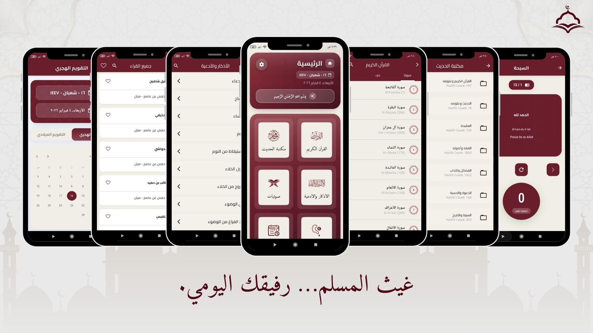

# غيث المسلم | Ghaith Muslim

**Your Comprehensive Islamic Companion & Quran Guide**

[Flutter](https://flutter.dev)
[Dart](https://dart.dev)
[Platform](https://flutter.dev)
[License](LICENSE)

---

## 🌟 Introduction | مقدمة

**Ghaith Muslim** is a premium, open-source Islamic application designed to provide every Muslim with essential tools for their daily spiritual journey. Built with Flutter, it offers a seamless and beautiful user experience across both Android and iOS devices.

**غيث المسلم** هو تطبيق إسلامي متكامل ومفتوح المصدر، صُمم ليوفر لكل مسلم الأدوات الأساسية في رحلته الإيمانية اليومية. تم تطويره باستخدام Flutter، مما يوفر تجربة مستخدم سلسة ورائعة على أجهزة الأندرويد والآيفون.

---

## 🌟 App Screenshots | صور التطبيق

<div align="center">
  
</div>

---

## ✨ Features | المميزات

### 📖 Holy Quran | القرآن الكريم

- **Full Text**: High-quality Uthmanic script.
- **Audio Library**: Recitations from world-renowned Qaris.
- **Tafsir & Translation**: Understand every Ayah deeply.
- **Interactive Player**: Smooth audio controls for listening and memorizing.

### 📅 Azkar | الأذكار

- **Azkar & Duaa**: Comprehensive collection of morning, evening, and daily supplications.

### 📻 Extra Tools | أدوات إضافية

- **Hijri Calendar**: Stay updated with Islamic dates.
- **Modern Interface**: Supports both Light and Dark modes with a premium aesthetic.

---

## 🛠️ Technical Stack | التقنيات المستخدمة

- **Framework:** [Flutter](https://flutter.dev)
- **State Management:** [Bloc](https://pub.dev/packages/flutter_bloc)
- **Local Storage:** [Hive](https://pub.dev/packages/hive) & [Shared Preferences](https://pub.dev/packages/shared_preferences)
- **Localization:** [Easy Localization](https://pub.dev/packages/easy_localization)
- **Audio:** [Just Audio](https://pub.dev/packages/just_audio)
- **Networking:** [Dio](https://pub.dev/packages/dio) & [HTTP](https://pub.dev/packages/http)
- **Tools:** `Adhan` for prayer times, `Quran` for surah data.

---

## 🚀 Getting Started | البدء

### Prerequisites

- Flutter SDK (Recommended version: `3.19.5`)
- Android Studio / VS Code
- Git

### Installation

1. **Clone the repository:**

```bash
 git clone https://github.com/ahmedelsersy101/ghaith_muslim
```

2. **Navigate to project folder:**

```bash
 cd ghaith_muslim
```

3. **Install dependencies:**

```bash
 flutter pub get
```

4. **Run the app:**

```bash
 flutter run
```

---

Made with ❤️ for the Ummah

**Epic-Apps-Hub**
