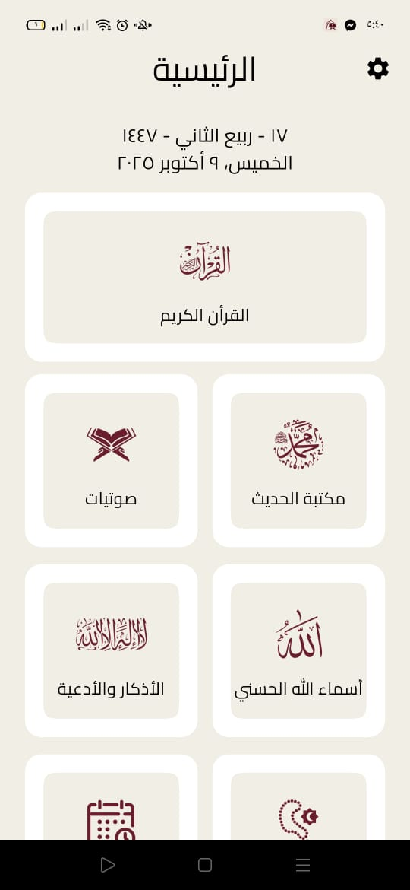
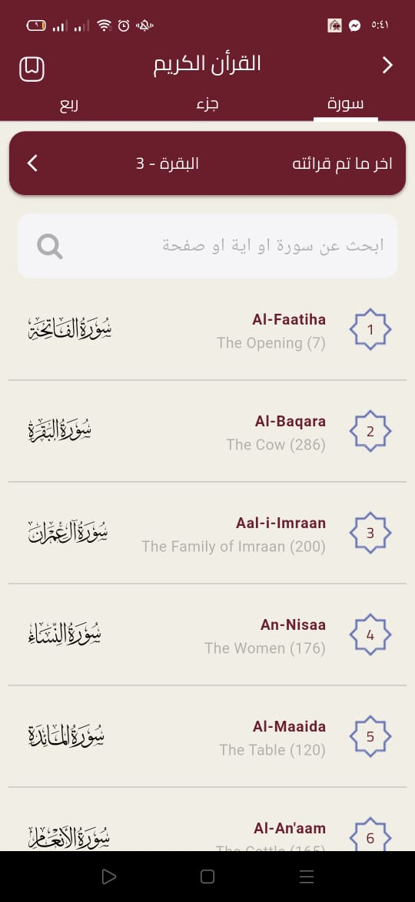
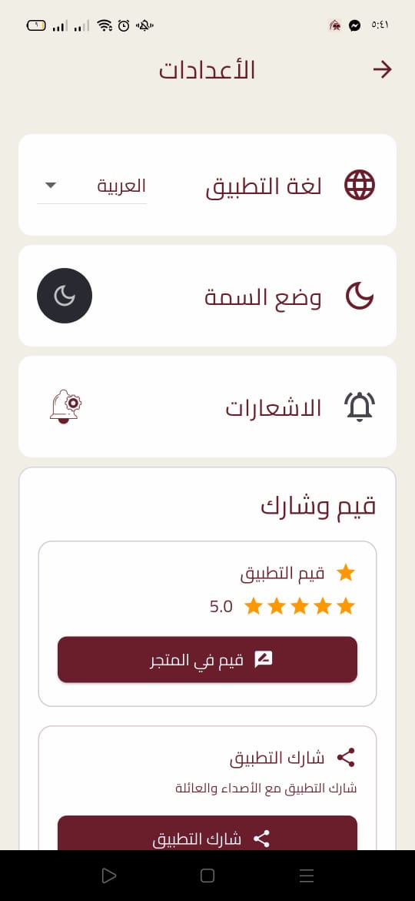

<div align="center">
  
  <h1>غيث المسلم | Ghaith Muslim</h1>
  <p><b>Your Comprehensive Islamic Companion & Quran Guide</b></p>

[](https://flutter.dev)
[](https://dart.dev)
[](https://flutter.dev)
[](LICENSE)

</div>

---

## 🌟 Introduction | مقدمة

**Ghaith Muslim** is a premium, open-source Islamic application designed to provide every Muslim with essential tools for their daily spiritual journey. Built with Flutter, it offers a seamless and beautiful user experience across both Android and iOS devices.

**غيث المسلم** هو تطبيق إسلامي متكامل ومفتوح المصدر، صُمم ليوفر لكل مسلم الأدوات الأساسية في رحلته الإيمانية اليومية. تم تطويره باستخدام Flutter، مما يوفر تجربة مستخدم سلسة ورائعة على أجهزة الأندرويد والآيفون.

---

## 📸 Screenshots | لقطات الشاشة

<div align="center">
  <table style="border-collapse: collapse; border: none;">
    <tr>
      <td style="padding: 10px; border: none;">
        
      </td>
      <td style="padding: 10px; border: none;">
        
      </td>
      <td style="padding: 10px; border: none;">
        
      </td>
      <td style="padding: 10px; border: none;">
        
      </td>
    </tr>
  </table>
</div>

---

## ✨ Features | المميزات

### 📖 Holy Quran | القرآن الكريم

- **Full Text**: High-quality Uthmanic script.
- **Audio Library**: Recitations from world-renowned Qaris.
- **Tafsir & Translation**: Understand every Ayah deeply.
- **Interactive Player**: Smooth audio controls for listening and memorizing.

### 📅 Prayer & Azkar | الصلاة والأذكار

- **Accurate Adhan**: Precise prayer times based on location.
- **Azkar & Duaa**: Comprehensive collection of morning, evening, and daily supplications.
- **99 Names of Allah**: Explore the meanings and beauty of Allah's names.

### 📻 Extra Tools | أدوات إضافية

- **Islamic Radio**: Live streams from various Islamic stations.
- **Hijri Calendar**: Stay updated with Islamic dates.
- **Modern Interface**: Supports both Light and Dark modes with a premium aesthetic.

---

## 🛠️ Technical Stack | التقنيات المستخدمة

- **Framework:** [Flutter](https://flutter.dev)
- **State Management:** [Bloc](https://pub.dev/packages/flutter_bloc)
- **Local Storage:** [Hive](https://pub.dev/packages/hive) & [Shared Preferences](https://pub.dev/packages/shared_preferences)
- **Localization:** [Easy Localization](https://pub.dev/packages/easy_localization)
- **Audio:** [Just Audio](https://pub.dev/packages/just_audio)
- **Networking:** [Dio](https://pub.dev/packages/dio) & [HTTP](https://pub.dev/packages/http)
- **Tools:** `Adhan` for prayer times, `Quran` for surah data.

---

## 🚀 Getting Started | البدء

### Prerequisites

- Flutter SDK (Recommended version: `3.19.5`)
- Android Studio / VS Code
- Git

### Installation

1. **Clone the repository:**
   ```bash
   git clone https://github.com/Epic-Apps-Hub/Skoon-Flutter-Islamic-App
   ```
2. **Navigate to project folder:**
   ```bash
   cd ghaith_muslim
   ```
3. **Install dependencies:**
   ```bash
   flutter pub get
   ```
4. **Run the app:**
   ```bash
   flutter run
   ```

---

## 🤝 Contributing | المساهمة

Contributions are welcome! If you have any ideas, feel free to open an issue or submit a pull request.

المساهمات مرحب بها! إذا كان لديك أي أفكار، فلا تتردد في فتح "Issue" أو تقديم "Pull Request".

---

<div align="center">
  <p>Made with ❤️ for the Ummah</p>
  <p><b>Epic-Apps-Hub</b></p>
</div>
